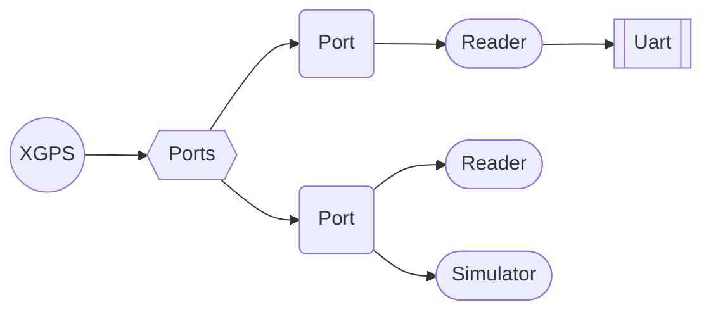

# XGPS
[](https://hex.pm/packages/xgps)

GPS for Elixir

XGPS runs as an application and will start along with you application, and connect to an serial port to get GPS data.

## Installation

If [available in Hex](https://hex.pm/docs/publish), the package can be installed as:

  1. Add `xgps` to your list of dependencies in `mix.exs`:

    ```elixir
    def deps do
      [{:xgps, ">= 0.0.0"}]
    end
    ```

  (Latest version can be found from the badge above. You can pin to a version by writing `{:xgps, "~> x.y.z"}`)

  2. Ensure `xgps` is started before your application:

    ```elixir
    def application do
      [applications: [:xgps]]
    end
    ```

  3. To make an effort to be platform independent, XGPS uses [circuits_uart](https://github.com/elixir-circuits/circuits_uart) for the dirty details. Please make sure to follow the instructions for circuits_uart to make this compile and run on your system.

## Usage: start
### Manually
Simply call:

  ```elixir
  XGPS.Ports.start_port("name-of-port")
  ```

### Config
Add a line like this in you config:

  ```elixir
  config :xgps, port_to_start: {"name-of-port"}
  ```

If your GPS is not requiering any special init commands, you will be OK with this line and the Generic driver.

### Config with driver
If you are using the Adafruit Ultimate GPS you can add:

  ```elixir
  config :xgps, port_to_start: {"/dev/ttyUSB0", "AdafruitGps"}
  ```

This will send a series of commands to your GPS to configure it.
The following commands are then sent:
- "$PMTK313,1*2E" => enable SBAS
- "$PMTK319,1*24" => Set SBAS to not test mode
- "$PMTK301,2*2E" => Enable SBAS to be used for DGPS
- "$PMTK286,1*23" => Enable AIC (anti-inteference)
- "$PMTK314,0,1,0,1,0,0,0,0,0,0,0,0,0,0,0,0,0,0,0*28" => Output only RMC & GGA
- "$PMTK397,0*23" => Disable nav-speed threshold

These sentences will work to initialize other GPS-types supporting the PMTK command types.

Other driver types can be found in the folder [lib/xgps/driver/](lib/xgps/driver/). If your GPS type is missing, you can first try the Generic driver. If not working, you can add a new driver yourself, with the needed init commands.

## Usage: Get position

### Manually
This usage pattern is mostly for testing.
Call:

  ```elixir
  XGPS.Ports.get_one_position
  ```

to get the latest fixed positions.

Pay attention to the has_fix if it is true or false. If has_fix=false, you cannot trust the other values.

### Automatically (GenStage)
The most common usage pattern is to subscribe to the GenStage producer running.
Check out the code inside the example-folder for an implementation for a subscriber. You need to implement (or copy) similar code to your side to receive new positions.

## Usage: simulation

### Starting manually
Start a simulated port by calling the following:
```elixir
XGPS.Ports.start_port(:simulate)
```

### Auto-start from config
By adding a line to config:
```elixir
config :xgps, port_to_start: {:simulate}
```

### Sending simulated position
Send a simulated position using one of the following commands:
```elixir
XGPS.Ports.send_simulated_no_fix()
XGPS.Ports.send_simulated_position(1.1,2.2,3.3) # lat, lon, alt
```

### Start simulator with positions in file

By adding a line to config:
```elixir
config :xgps, port_to_start: {:simulate, "simulator_positions.txt"}
```

A simulator will start, and send the positions with 1 second delay between them. And continue from the start when reaching the end.

#### Prepare the position file

The repository have a simple position file called [simulator_positions.txt](simulator_positions.txt)
This file have two options on how to give positions. One without timestamp, which will sent current system utc time. And one with timestamp, which will send the given timestamp.

Have a look at the file [simulator_positions.txt](simulator_positions.txt) for details on how to format the file properly.


## Note
This application was tested on a Raspberry Pi using the AdaFruit Ultimate GPS ([1](https://www.adafruit.com/products/746), [2](https://www.adafruit.com/products/2324)), which essentially uses the chip MTK3339. Guarantees for other systems and chips cannot be given. But please provide feedback if working or not on other systems/chips.

## Supervisor tree

The supervisor tree will look different if the simulator is running or not. This diagram shows two ports running at the same time. One connected to a physical UART, while the other one has a simulator running.

